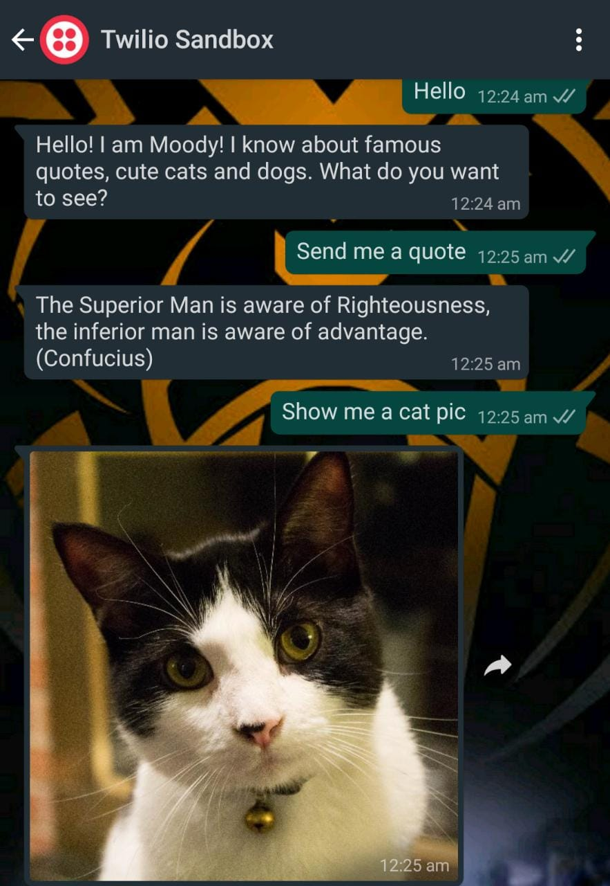

## Moody_WhatsApp_Bot
A chatbot for WhatsApp using the Twilio API for WhatsApp and the Flask framework for Python

## **Tech Stacks Used**
**Python:** 3.6 or newer

**Flask:** We will create a web application that responds to incoming WhatsApp messages with it

**ngrok:** We will use this handy utility to connect the Flask application running on your system to a public URL that Twilio can connect to

**A smartphone** with an active phone number and WhatsApp installed

**A Twilio** account for **Twilio WhatsApp Sandbox**

## **Sample Interaction**

 
